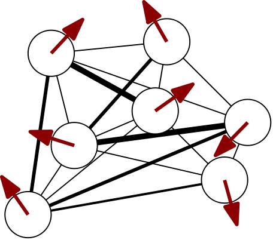

</img>

## Deep Implicit Attention

---

Experimental implementation of deep implicit attention in PyTorch.

**Summary:** Using deep equilibrium networks to implicitly solve a set of self-consistent mean-field equations of a random Ising model implements attention as a collective response 🤗 and provides insight into the transformer architecture, connecting it to mean-field theory, message-passing algorithms, and Boltzmann machines.

**Blog post: Deep Implicit Attention: A Mean-Field Theory Perspective on Attention Mechanisms (in preparation)**

## To-do

### Modules
- [x] Add a `GeneralizedIsingGaussianAdaTAP` module implementing the adaptive TAP mean-field equations for an Ising-like vector model with standard multivariate Gaussian priors over spins
- [ ] Make the parameters of the multivariate Gaussian priors in `GeneralizedIsingGaussianAdaTAP` trainable
- [ ] Add the analytical expression of the appropriate adaptive TAP Gibbs free energy for `GeneralizedIsingGaussianAdaTAP` so it can be used as a stand-alone loss function for the system
- [ ] Add a pedagogical `VanillaSoftmaxAttention` module which reproduces vanilla softmax attention, i.e. implementing coupling weights between spins which depend solely on linear transformations of the external sources (queries/keys) and replacing the self-correction term with a parametrized position-wise feed-forward network

### Models
- [ ] Add a `DeepImplicitAttentionTransformer` model
- [ ] Add a `DeepImplicitAttentionViT` model
- [ ] Add a `DeepImplicitAttentionAgent` model

### Miscellaneous
- [ ] Add additional fixed-point / root solvers (e.g. Broyden)
- [ ] Add examples (MNIST, sequence tasks, ...)

## Setup

Install package in editable mode:

```bash
$ pip install -e .
```

Run tests with:

```bash
$ python -m unittest
```

## Examples

See `tests` for now until `examples` folder is populated.

## References

### Selection of literature
On variational inference, iterative approximation algorithms, expectation propagation, mean-field methods and belief propagation:
- [Expectation Propagation](https://arxiv.org/abs/1409.6179) (2014) by Jack Raymond, Andre Manoel, Manfred Opper

On the adaptive Thouless-Anderson-Palmer (TAP) mean-field approach in disorder physics:
- [Adaptive and self-averaging Thouless-Anderson-Palmer mean-field theory for probabilistic modeling](https://link.aps.org/doi/10.1103/PhysRevE.64.056131) (2001) by Manfred Opper and Ole Winther


On Boltzmann machines and mean-field theory:
- [Efficient Learning in Boltzmann Machines Using Linear Response Theory](https://doi.org/10.1162/089976698300017386) (1998) by H. J. Kappen and
F. B. Rodríguez
- [Mean-field theory of Boltzmann machine learning](https://link.aps.org/doi/10.1103/PhysRevE.58.2302) (1998) by Toshiyuki Tanaka

On deep equilibrium networks:
- [Deep Equilibrium Models](https://arxiv.org/abs/1909.01377) (2019) by Shaojie Bai, Zico Kolter, Vladlen Koltun
- [Chapter 4: Deep Equilibrium Models](https://implicit-layers-tutorial.org/deep_equilibrium_models/) of the [Deep Implicit Layers - Neural ODEs, Deep Equilibirum Models, and Beyond](http://implicit-layers-tutorial.org/), created by Zico Kolter, David Duvenaud, and Matt Johnson


### Code inspiration

- http://implicit-layers-tutorial.org/
- https://github.com/locuslab/deq
- https://github.com/lucidrains?tab=repositories
